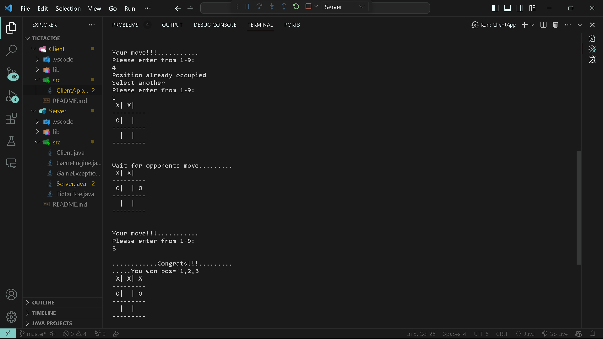

# Tic-Tac-Toe Java

A console-based , client-server application for a two-player Tic Tac Toe game using Java Programming.


## Usage/Examples

```javascript

First, Run/Start the Server.
In order to do so,compile the Server.java file . 

Secondly, Compile the ClientApp.java file .
This will begin the game.


Its needed to connect both the laptop using the same IP addresses and
port number to establish a connection and play with game.


```


## Features

- Java Server Programming
- Console based application
- Client-Server Model


## Screenshots



